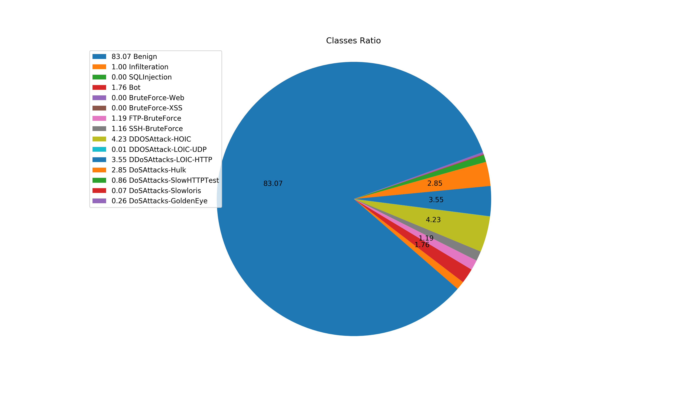
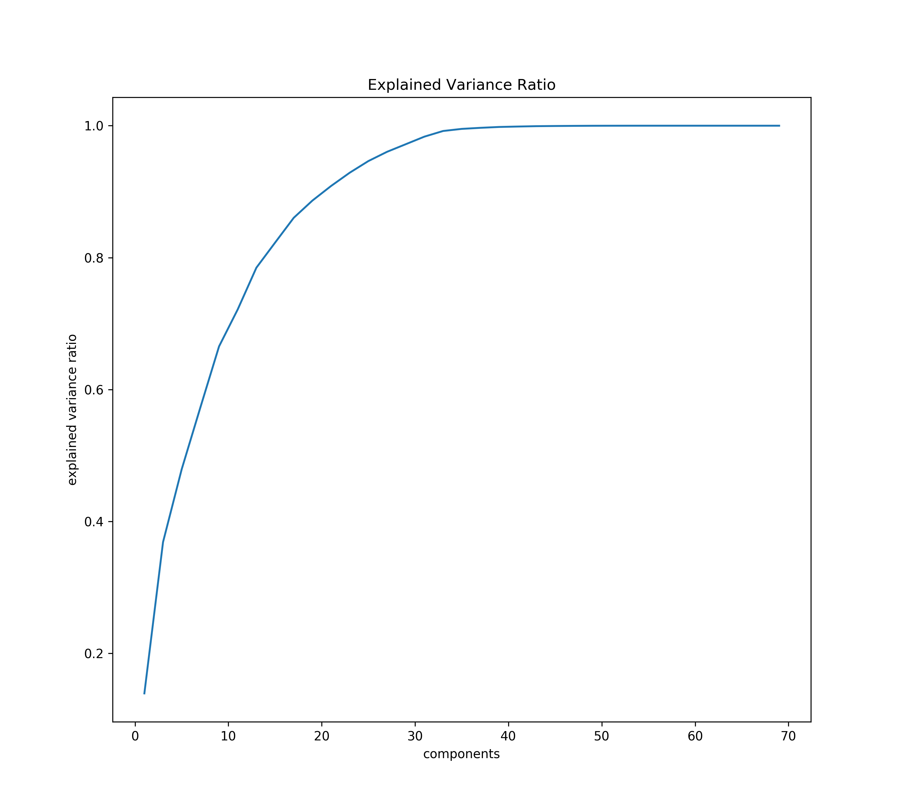
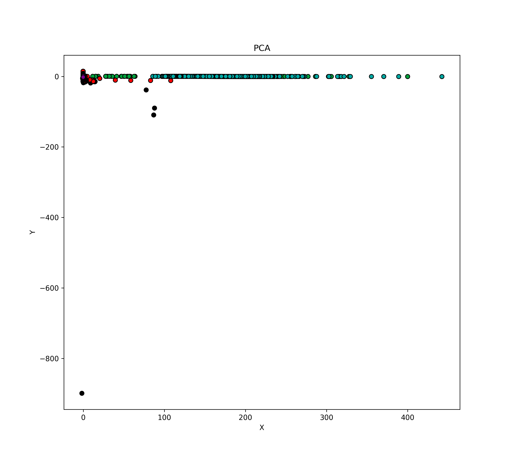
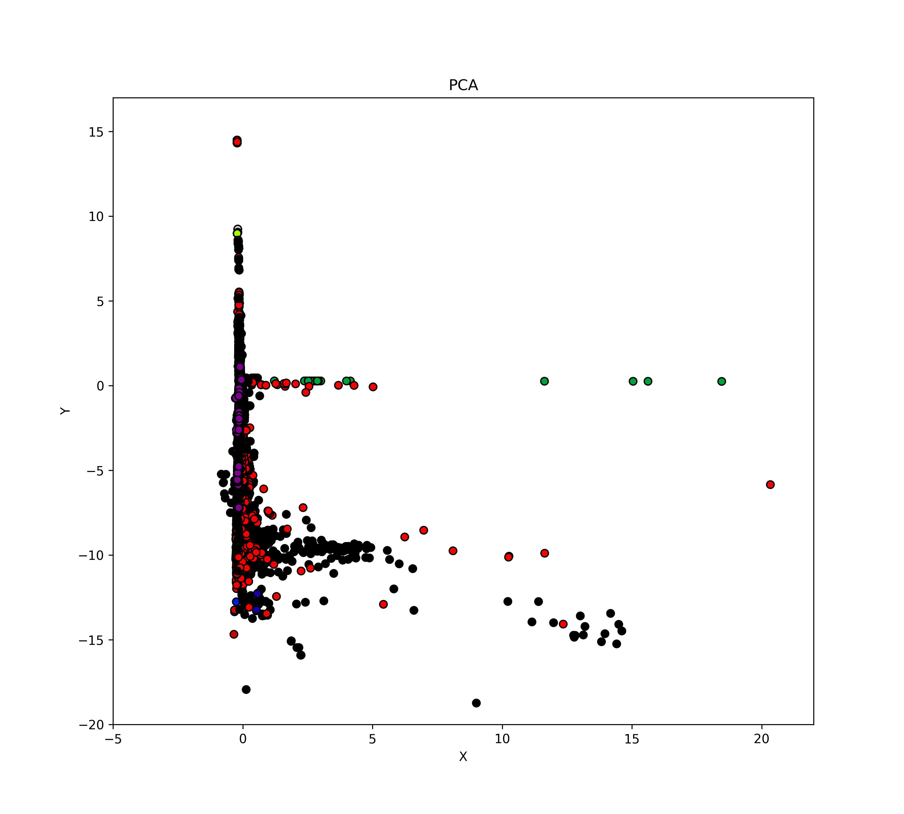

# IDS-2018

**classes:**

* Benign
* Bot
* Infilteration
* SQL Injection
* Brute Force -Web
* Brute Force -XSS
* FTP-BruteForce
* SSH-Bruteforce
* DDOS attack-HOIC
* DDOS attack-LOIC-UDP
* DDoS attacks-LOIC-HTTP
* DoS attacks-Hulk
* DoS attacks-SlowHTTPTest
* DoS attacks-Slowloris
* DoS attacks-GoldenEye

**files:**

* Friday-02-03-2018_TrafficForML_CICFlowMeter.csv (Benign, Bot)
* Friday-16-02-2018_TrafficForML_CICFlowMeter.csv (Benign, DoS attacks-SlowHTTPTest, DoS attacks-Hulk)
* Friday-23-02-2018_TrafficForML_CICFlowMeter.csv (Benign, SQL Injection, Brute Force -XSS, Brute Force -Web)
* Thuesday-20-02-2018_TrafficForML_CICFlowMeter.csv (Benign, DDoS attacks-LOIC-HTTP)
* Thursday-01-03-2018_TrafficForML_CICFlowMeter.csv (Benign, Infilteration)
* Thursday-15-02-2018_TrafficForML_CICFlowMeter.csv (Benign, DoS attacks-GoldenEye, DoS attacks-Slowloris)
* Thursday-22-02-2018_TrafficForML_CICFlowMeter.csv (Benign, SQL Injection, Brute Force -XSS, Brute Force -Web)
* Wednesday-14-02-2018_TrafficForML_CICFlowMeter.csv (Benign, FTP-BruteForce, SSH-Bruteforce)
* Wednesday-21-02-2018_TrafficForML_CICFlowMeter.csv (Benign, DDOS attack-HOIC, DDOS attack-LOIC-UDP)

**features:**

* all except thuesday file:
  * Dst Port
  * Protocol
  * Timestamp
  * Flow Duration
  * Tot Fwd Pkts
  * Tot Bwd Pkts
  * TotLen Fwd Pkts
  * TotLen Bwd Pkts
  * Fwd Pkt Len Max
  * Fwd Pkt Len Min
  * Fwd Pkt Len Mean
  * Fwd Pkt Len Std
  * Bwd Pkt Len Max
  * Bwd Pkt Len Min
  * Bwd Pkt Len Mean
  * Bwd Pkt Len Std
  * Flow Byts/s
  * Flow Pkts/s
  * Flow IAT Mean
  * Flow IAT Std
  * Flow IAT Max
  * Flow IAT Min
  * Fwd IAT Tot
  * Fwd IAT Mean
  * Fwd IAT Std
  * Fwd IAT Max
  * Fwd IAT Min
  * Bwd IAT Tot
  * Bwd IAT Mean
  * Bwd IAT Std
  * Bwd IAT Max
  * Bwd IAT Min
  * Fwd PSH Flags
  * Bwd PSH Flags
  * Fwd URG Flags
  * Bwd URG Flags
  * Fwd Header Len
  * Bwd Header Len
  * Fwd Pkts/s
  * Bwd Pkts/s
  * Pkt Len Min
  * Pkt Len Max
  * Pkt Len Mean
  * Pkt Len Std
  * Pkt Len Var
  * FIN Flag Cnt
  * SYN Flag Cnt
  * RST Flag Cnt
  * PSH Flag Cnt
  * ACK Flag Cnt
  * URG Flag Cnt
  * CWE Flag Count
  * ECE Flag Cnt
  * Down/Up Ratio
  * Pkt Size Avg
  * Fwd Seg Size Avg
  * Bwd Seg Size Avg
  * Fwd Byts/b Avg
  * Fwd Pkts/b Avg
  * Fwd Blk Rate Avg
  * Bwd Byts/b Avg
  * Bwd Pkts/b Avg
  * Bwd Blk Rate Avg
  * Subflow Fwd Pkts
  * Subflow Fwd Byts
  * Subflow Bwd Pkts
  * Subflow Bwd Byts
  * Init Fwd Win Byts
  * Init Bwd Win Byts
  * Fwd Act Data Pkts
  * Fwd Seg Size Min
  * Active Mean
  * Active Std
  * Active Max
  * Active Min
  * Idle Mean
  * Idle Std
  * Idle Max
  * Idle Min
  * Label
* thuesday file header has 4 more columns:
  * Flow ID
  * Src IP
  * Src Port
  * Dst IP
  
**features transformation:**

* features that have only one value were removed:
    * Bwd Blk Rate Avg, Bwd Byts/b Avg, Bwd PSH Flags, Bwd Pkts/b Avg, Bwd URG Flags, Fwd Blk Rate Avg, Fwd Byts/b Avg, Fwd Pkts/b Avg
* also Timestamp was removed
* some features contain "inf" and "nan" value:
    * "nan" was replaced by value that has the biggest occurrence
    * "inf" was replaced by the biggest value
    * Flow Byts/s - "nan" was replaced by 0 and "inf" by 1806642857.14286
    * Flow Pkts/s - "nan" was replaced by 1000000 and "inf" by 6000000.0
* all features were normalized by mean and standard deviation   
  
**classes ratio:**

* Number of samples: 16 232 943
* Benign: 13 484 708 (83.0700139%)
* Bot: 286 191 (1.7630260%)
* Infilteration: 161 934 (0.9975640%)
* SQL Injection: 87 (0.0005359%)
* Brute Force -Web: 611 (0.0037640%)
* Brute Force -XSS: 230 (0.0014169%)
* FTP-BruteForce: 193 360 (1.1911580%)
* SSH-Bruteforce: 187 589 (1.1556068%)
* DDOS attack-HOIC: 686 012 (4.2260482%)
* DDOS attack-LOIC-UDP: 1 730 (0.0106573%)
* DDoS attacks-LOIC-HTTP: 576 191 (3.5495166%)
* DoS attacks-Hulk: 461 912 (2.8455222%)
* DoS attacks-SlowHTTPTest: 139 890 (0.8617661%)
* DoS attacks-Slowloris: 10 990 (0.0677018%)
* DoS attacks-GoldenEye: 41 508 (0.2557022%)

**Train/test/validation split:**

* full train dataset contains 80% of data (12 986 236 rows)
* test dataset contains 20% of data (3 246 707 rows)
* full train was split on train (80%, 10 388 967) and validation (20%, 2 597 269 rows)
* train classes ratio is same as for whole dataset:

* test classes ratio is same as for whole dataset:

**Explained variance:**

* for x < 19 components - not very high 
* 19 components - 0.886
* 21 components - 0.910
* 27 components - 0.960
* 29 components - 0.972
* 31 components - 0.983
* 33 components - 0.992
* 35 components - 0.995
* for x > 35 components - almost 1.0

**data visualization:**

**logistic regression for feature selection:**
* for each one logistic regression was trained
* because of unbalanced classes attack detection was not very good
* that's why classes weights needs to be specified
* classes and weights based on classes occurrences:
    * Benign - (2.95339791, 0.60189949)
    * Bot - (0.50897327, 28.36051463)
    * Brute Force -Web - (5.00006882e-01, 3.63250594e+04)
    * Brute Force -XSS - (5.00018626e-01, 1.34224380e+04)
    * DDOS attack-HOIC - (0.52206274, 11.83132367)
    * DDOS attack-LOIC-UDP - (5.00053187e-01, 4.70089005e+03)
    * DDoS attacks-LOIC-HTTP - (0.51840077, 14.08639111)
    * DoS attacks-GoldenEye - (0.5012817, 195.55334488)
    * DoS attacks-Hulk - (0.51464435, 17.5714293)
    * DoS attacks-SlowHTTPTest - (0.50434616, 58.02206622)
    * DoS attacks-Slowloris - (5.00338617e-01, 7.38797255e+02)
    * FTP-BruteForce - (0.50602754, 41.97630265)
    * Infilteration - (0.50503736, 50.12915694)
    * SQL Injection - (5.00002503e-01, 9.98939135e+04)
    * SSH-Bruteforce - (0.50584556, 43.26753155)
* the best found weights:
    * Benign - (2.95339791, 0.60189949 * 3)
    * Bot - (0.50897327 * 3.3113, 28.36051463)
    * Brute Force -Web - (5.00006882e-01 * 3, 3.63250594e+04)
    * Brute Force -XSS - (5.00018626e-01 * 1.5, 1.34224380e+04)
    * DDOS attack-HOIC - (0.52206274 * 7., 11.83132367)
    * DDOS attack-LOIC-UDP - (5.00053187e-01, 4.70089005e+03)
    * DDoS attacks-LOIC-HTTP - (0.51840077 * 1.7625, 14.08639111)
    * DoS attacks-GoldenEye - (0.5012817 * 2.6647, 195.55334488)
    * DoS attacks-Hulk - (0.51464435 * 3.65, 17.5714293)
    * DoS attacks-SlowHTTPTest - (0.50434616 * 6.5, 58.02206622)
    * DoS attacks-Slowloris - (5.00338617e-01 * 1.65, 7.38797255e+02)
    * FTP-BruteForce - (0.50602754 * 4.6, 41.97630265)
    * Infilteration - (0.50503736 * 1.25, 50.12915694)
    * SQL Injection - (5.00002503e-01 * 1.75, 9.98939135e+04)
    * SSH-Bruteforce - (0.50584556 * 7.78, 43.26753155)
   

